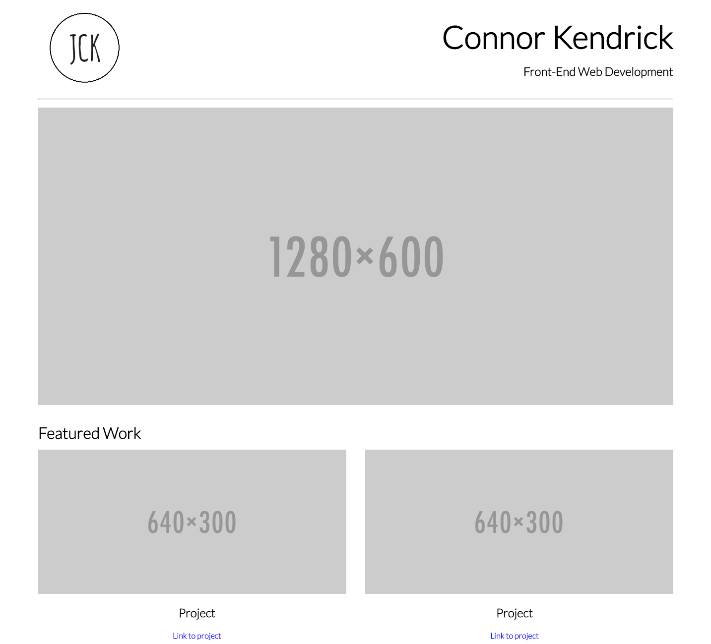

# Portfolio Mockup (Udacity Tutorial)

This portfolio mock-up was part of the HTML/CSS tutorial on Udacity, and uses a simple 12 column CSS grid framework.  

Problems I encountered: I had to add the two project images as equally sized columns, which left no space between the images.
To fix this, I made the images only take up a certain percentage of the columns, but this produced another problem:
When I needed text to be underneath the images, it could not be centered to the *images*, but only the *columns*. This made the text off-center.  

Other than this issue, the custom framework that I used make the process of lining things up much more simple. Yay flexbox! :tada: :tada: :tada:
